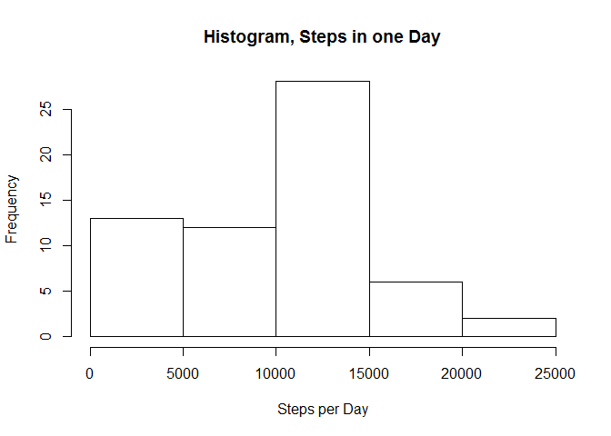
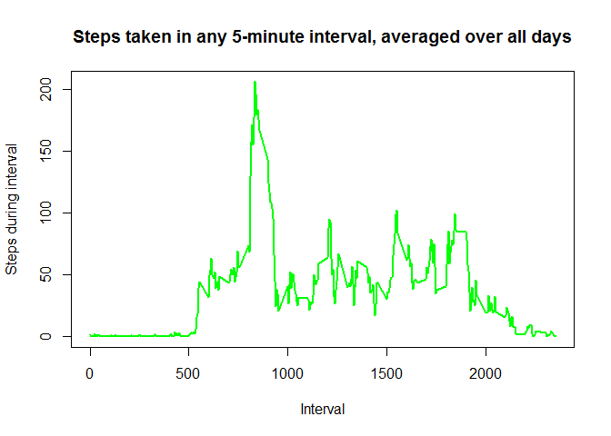
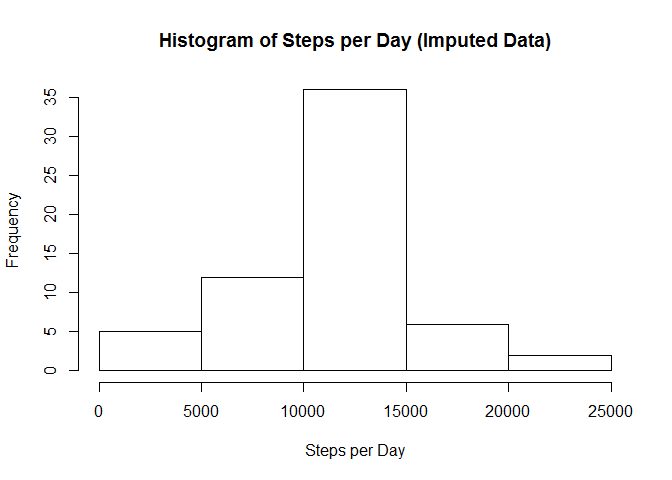
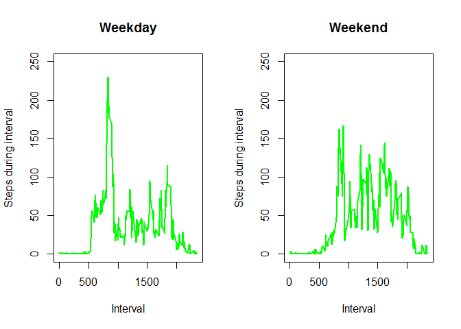

# Reproducible Research: Peer Assessment 1

The goal of this analysis is to shed light on the variation in physical activity across time.

## Loading and preprocessing the data

The following code chunk downloads the data from the Internet. Specifically, if the data file ("activity.csv") is not in the working directory, the code looks for the data file's zipped version ("repdata%2Fdata%2Factivity.zip"). If the zipped file is in the working directory, the code unzips it, yielding "activity.csv" in the working directory. If even the zipped data is missing from the working directory, the code downloads the data from the Web and then unzips it, once again yielding "activity.csv".


```r
dataFile <- "activity.csv"
zipFile <- "repdata%2Fdata%2Factivity.zip"

if(!file.exists(dataFile)) {
  if(!file.exists(zipFile)) {
    temp <- tempfile()
    download.file("https://d396qusza40orc.cloudfront.net/repdata%2Fdata%2Factivity.zip",temp)
    dataFile <- unzip(temp)
    unlink(temp)
    rm(temp)
  } 
  else {
    dataFile <- unzip(zipFile)
    rm(zipFile)
  }
}
```

The next code chunk reads the data and changes the class of the activity$date variable to *date*.


```r
activity <- read.csv("activity.csv")
activity$date <- as.Date(activity$date)
```

## What is mean total number of steps taken per day?

I begin the analysis by loading the dplyr package, which will be used throughout. 


```r
library("dplyr")
```

The next code chunk selects all observations that belong to a particular day and adds all steps taken during that day. This is repeated for all days. The end result is a data frame that shows the *total* steps taken on each day. Then, I calculate the *mean* and the *median* of the number of steps taken per day.


```r
activity.date <- group_by(activity, date)
total.steps.date <- summarize(activity.date, steps.date = sum(steps, na.rm = TRUE))
mean(total.steps.date$steps.date, na.rm = TRUE)
```

```
## [1] 9354.23
```

```r
median(total.steps.date$steps.date, na.rm = TRUE)
```

```
## [1] 10395
```


## What is the average daily activity pattern?

The day-to-day variation in steps taken by our individual is shown with a *histogram of the steps taken in one day*:


```r
hist(total.steps.date$steps.date, main = "Histogram, Steps in one Day", xlab = "Steps per Day")
```

<!-- -->

The number of steps taken varies within each day as well. The next code chunk studies this within-day variation in physical activity. It selects all observations that belong to a particular interval of time and calculates the number of steps taken during that interval averaged over all days. This is repeated for all intervals. The end result is a data frame that shows the average number of steps taken during any given interval. 


```r
activity.interval <- group_by(activity, interval)
mean.steps.interval <- summarize(activity.interval, steps.interval = mean(steps, na.rm = TRUE))
```

It is now possible to find **the interval for which the number of steps (averaged over all days) is the highest**:


```r
mean.steps.interval$interval[which.max(mean.steps.interval$steps.interval)]
```

```
## [1] 835
```

The interval-to-interval variation in the average number of steps taken can also be seen in the plot created by the following code chunk:


```r
plot(mean.steps.interval$interval, mean.steps.interval$steps.interval, type="l", xlab= "Interval", ylab= "Steps during interval", col="green" , lwd=2, main = "Steps taken in any 5-minute interval, averaged over all days")
```

<!-- -->


## Imputing missing values

The data set has a substantial number of missing values (coded as NAs). Here is the **total number of rows with missing values**:


```r
nrow(activity) - nrow(na.omit(activity))
```

```
## [1] 2304
```

And the summary command shows that all missing values are in the steps variable:


```r
summary(activity)
```

```
##      steps             date               interval     
##  Min.   :  0.00   Min.   :2012-10-01   Min.   :   0.0  
##  1st Qu.:  0.00   1st Qu.:2012-10-16   1st Qu.: 588.8  
##  Median :  0.00   Median :2012-10-31   Median :1177.5  
##  Mean   : 37.38   Mean   :2012-10-31   Mean   :1177.5  
##  3rd Qu.: 12.00   3rd Qu.:2012-11-15   3rd Qu.:1766.2  
##  Max.   :806.00   Max.   :2012-11-30   Max.   :2355.0  
##  NA's   :2304
```

I will now impute the missing values. 

First, I merge the original data in the activity data frame with the mean.steps.interval data frame obtained above. This adds a new variable, steps.interval, to the activity data frame. (Recall that the steps.interval variable gives the number of steps taken in any given interval, averaged across all days.)


```r
activity2 <- merge(activity, mean.steps.interval)
```


Second, I rearrange the observations by date.


```r
activity2 <- arrange(activity2, date)
```

The next code chunk is crucial. It replaces the missing values in the *steps* variable with the corresponding values in the *steps.interval* variable.


```r
activity2$steps[is.na(activity2$steps)] = activity2$steps.interval
```

Finally, I get rid of the steps.interval variable, thereby making the activity2 data frame identical to the original activity data frame, except that, for each observation, the missing values in the activity$steps variable have been replaced by average number of steps taken during the corresponding interval.


```r
activity2 <- select(activity2, -steps.interval)
```

Now, we can repeat some of the earlier analysis, which had used the original data with 2304 missing values, but now with the *imputation-augmented data*. The mean, median, and histogram of the number of steps taken per day are now calculated for the imputation-augmented data exactly as was done earlier for the original data, which did not have imputed missing values.


```r
activity2.date <- group_by(activity2, date)
total.steps.date2 <- summarize(activity2.date, steps.date = sum(steps))
mean(total.steps.date2$steps.date)
```

```
## [1] 10766.19
```

```r
median(total.steps.date2$steps.date)
```

```
## [1] 10766.19
```

```r
hist(total.steps.date2$steps.date, main = "Histogram of Steps per Day (Imputed Data)", xlab = "Steps per Day")
```

<!-- -->

Note that *both the mean and the median of steps taken per day are higher when the missing values are imputed*.

## Are there differences in activity patterns between weekdays and weekends?

Recall that the *activity2* data frame contains the imputation-augmented data. The next code chunk adds a new factor variable, *wDay*, to *activity2*. This new variable specifies whether the date in an observation corresponds to a weekday or a weekend.


```r
weekdays1 <- c('Monday', 'Tuesday', 'Wednesday', 'Thursday', 'Friday')
activity2$wDay <- factor((weekdays(as.Date(activity2$date)) %in% weekdays1), levels=c(FALSE, TRUE), labels=c("weekend", "weekday"))
```

The next code chunk looks at all observations in the imputation-augmented data frame that belong to a particular interval *and* a particular wDay, and calculates the average number of steps taken. This is repeated for all possible pairs of *interval* and *wDay* values. The result is *mean.steps.interval.wDay*, which is a data frame that gives the average number of steps taken for any given interval for a weekday or for a weekend.


```r
activity2.interval.wDay <- group_by(activity2, interval, wDay)
mean.steps.interval.wDay <- summarize(activity2.interval.wDay, steps.interval.wDay = mean(steps))
```

Finally, I create a panel plot of two graphs, one for weekdays and the other for weekends, showing how the average number of steps taken varies across intervals. 


```r
mean.steps.interval.weekdays <- filter(mean.steps.interval.wDay, wDay == "weekday")
mean.steps.interval.weekends <- filter(mean.steps.interval.wDay, wDay == "weekend")

par(mfrow=c(1,2))
plot(mean.steps.interval.weekdays$interval, mean.steps.interval.weekdays$steps.interval.wDay, type="l", xlab= "Interval", ylab= "Steps during interval", col="green" , lwd=2, ylim = c(0,250), main = "Weekday")
plot(mean.steps.interval.weekends$interval, mean.steps.interval.weekends$steps.interval.wDay, type="l", xlab= "Interval", ylab= "Steps during interval", col="green" , lwd=2, ylim = c(0,250), main = "Weekend")
```

<!-- -->


We see that *for the earlier part of the day, people are more active on weekdays*. However, *for the latter part of the day, people are somewhat more active on weekends*.


## Conclusion

This assignment shows how physical activity varies (a) from day to day, (b) from interval to interval during a day, and (c) from weekdays to the weekend. This assignment also shows that the results of data analysis depend on whether and how missing values are imputed.
